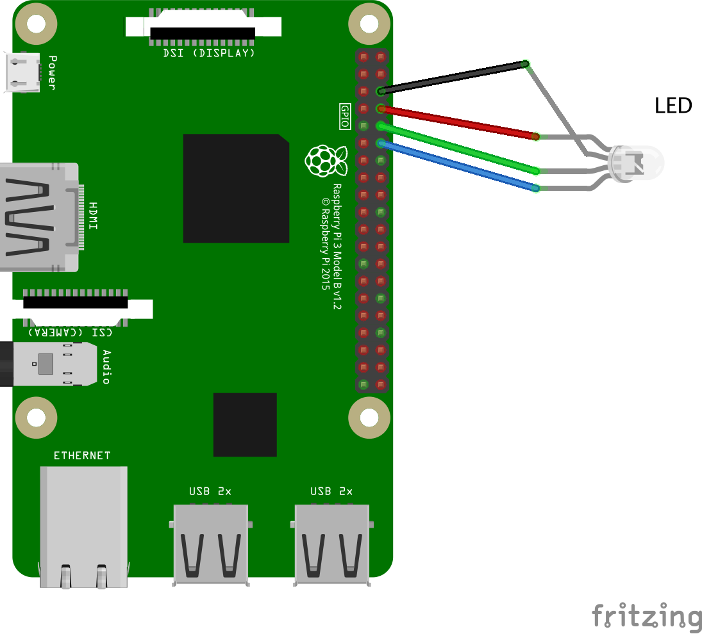

# 树莓派GPIO编程-实现RGB三色LED灯闪烁

## 一、实验基础

### 1.连接树莓派

#### 1.1.SSH

`ssh pi@192.168.xxx.xxx`

~~`PASSWORD:`~~`raspberry`

#### 1.2.VNC Viewer

### 2.引脚

*Raspberry Pi 3 Model B*

### 3.图示
#### 3.1.面包板

#### 3.2.原理图

## 二、实验内容

### 1.Python控制GPIO
1. 源代码 

    [rgb1.py](/rgb1.py)

2. 运行  
    `python3 rgb1.py`

### 2.WiringPi控制GPIO

#### 2.1.安装WiringPi
1. 下载  
	`git clone git://git.drogon.net/wiringPi`
	
2. 编译  
	`cd wiringPi`  
	`./build`

3. 验证  
	`gpio -v`
#### 2.2.控制GPIO
1. 源代码

   [rgb2.c](/rgb2.c)

2. 编译并运行  
    `gcc -Wall rgb2.c -o rgb2 -lwiringPi`  
    `sudo ./led2`

## 三、实验结果

  
  
  

